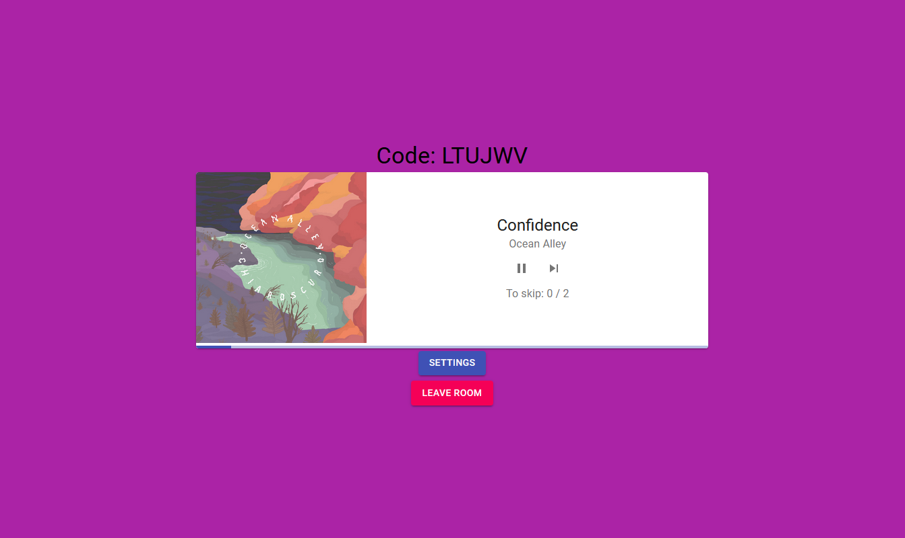

# Music Controller

Create party rooms and control music that is played on your Spotify account.

Integrated with Spotify API lets you control music at your spotify account, play next song, pause. Create rooms, let guest vote to skip song (actual skipping only for premium spotify account :( ).
Songs are played in Spotify app (browser, phone, tv, ...) not in app itself.
App created with Django on the backend and React on frontend. Styling with Material UI.

# Features

- Authenticate Spotify user
- Create room (host)
- Join room (guest)
- Enable voting (host)
- Vote for song to skip (guest)
- Skip song (host) (actual skipping only for premium spotify account :( )
- Pause song (host)
- Display song's progress
- Display album cover
- Set required votes to skip

# Setup

## Spotify developer account

In order to run this app you need Spotify Developer account!

- Create account for free at [spotify](https://developer.spotify.com/).
- Register app and get Client ID and Secret Key.

## Steps

1. Download project and install packages.

```
cd .
pip3 install -r requirements.txt
```

2. Enter Client ID and Secret key from your developer's account app into ".env-your_data_here". Remove "-your_data_here" from file name.

```
RENAME:
.env-your_data_here --> .env

UPDATE:
CLIENT_ID = "..."
CLIENT_SECRET = "..."
```

3. Run Django server

```
python3 manage.py runserver
```
